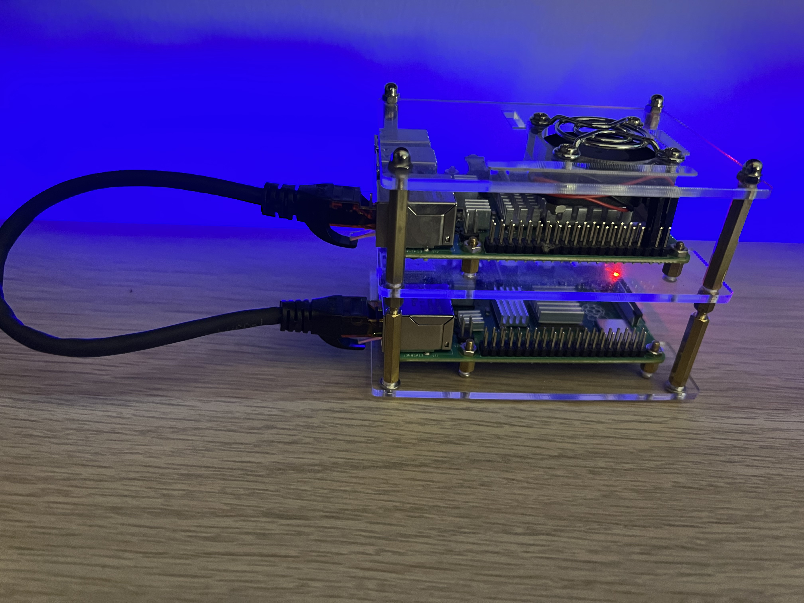

# k8s-pi

## Cluster

    

- Raspberry Pi 4 Model B 8 GB RAM 64GB MicroSD (**pi-master-01**)
- Raspberry Pi 4 Model B 2 GB RAM 64GB MicroSD (**pi-node-01**)

| Type | Hostname | HW | RAM | Storage | IP | OS |
| --- | --- | --- | --- | --- | --- | --- |
| Master | pi-master-01 | Raspberry Pi 4 Model B | 8 GB | 64GB | 192.168.1.190 | Ubuntu Server 20.04 LTS 64 bit |
| Worker | pi-node-01 | Raspberry Pi 4 Model B | 2 GB | 32 GB | 192.168.1.200 | Ubuntu Server 20.04 LTS 64 bit |

